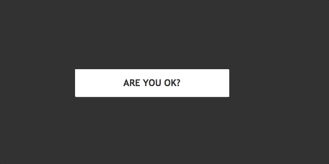

<center>

</center>

<center style="color:#4d4d4d">A Button Component of React. Inspired By <a href="https://codepen.io/thebabydino/pen/vQNVQe/">Hover/focus effects</a></center>

## Get Started

### install

```bash
npm i react-hover-button
```

### usage

```jsx
import React, { useEffect, useRef, useState } from "react";
import { render } from "react-dom";
import { HoverButtonDiagonal } from "react-hover-button";

function ButtonDemoList() {
  const hoverBtn = useRef(null);
  const [loading, switchLoading] = useState(false);
  useEffect(_ => {
    hoverBtn.current.addEventListener(
      "click",
      _ => switchLoading(prev => !prev),
      false
    );
  }, []);

  return (
    <div ref={hoverBtn}>
      <HoverButtonDiagonal width={300} color="#333" loading={loading}>
        Hover me!
      </HoverButtonDiagonal>
    </div>
  );
}
render(<ButtonDemoList />, document.getElementById("root"));
```

#### Props List

```json
  color = "#000"，//font color
  width = "12em", // button width
  height,   // button height and lineheight
  background, // buton backgound
  maskColor, // mask color and background color
  children = "Hover me",
  onClick,
  loading = false
```
